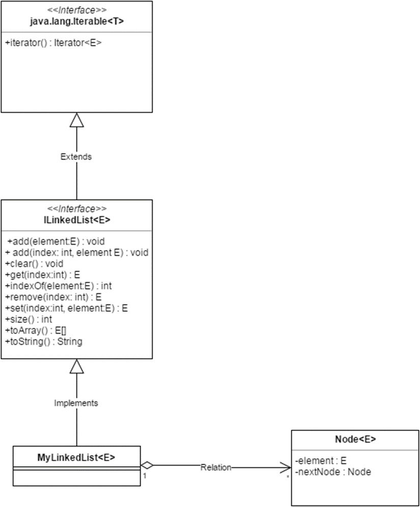

## 1. implementation of a doubly linked LinkedList
### Run: MainClass

## 2.Test: JMH
###  Comparative analysis of the performance of the main Java collections
#### a. Compare the performance of ArrayList and LinkedList for basic operations
#### b. Compare the performance of HashSet, LinkedHashSet, TreeSet for basic operations
#### c. Compare the performance of HashMap, LinkedHashMap, TreeMap
